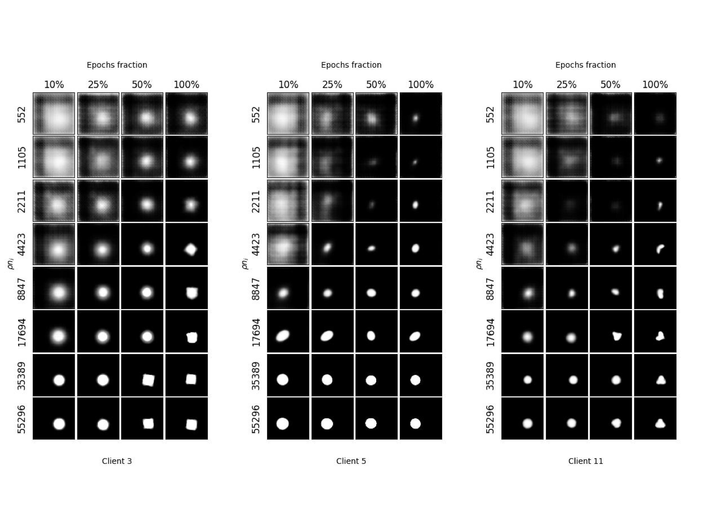

# `Fedssyn` Synthetic Federated dSprites Dataset

`Fedssyn` Synthetic dSprites is a Federated dSprites dataset generated by β-VAE [[2]](#2) based on the dSprites dataset [[1]](#1). The base dataset consists of 2D shapes procedurally generated from 6 ground-truth independent latent factors. These factors are color(1), shape(3), scale(6), rotation(40), x(32), and y(32) positions of a sprite, and the value in parentheses indicates the number of possible values in the corresponding latent factor. The steps for generating our dataset are defined below. The data is used for our experiments in the [`Fedssyn` framework](https://arxiv.org/abs/2306.13263).

## Links to the dataset
- [[Synthetic](https://drive.google.com/drive/folders/1K8shhT3peHbYLl1-alhAC2cIl9R_NpSi?usp=share_link)]
- [[Real](https://drive.google.com/drive/folders/1UghHxkLiZxH8dNPcYm3r0qxbKEff1t7f?usp=sharing)]

## Dataset curation
### 1. Data Split
We first randomly select 10% of the images from the dSprites dataset to formulate the global test set. For the rest of the dataset, we split the data among 12 clients ($N=12$), based on the four spatial locations (top-left, bottom-left, top-right, or bottom-right) and three shapes (square, ellipse, or heart) such that each client only sees a single type of shape from one of the four pre-defined locations. For example, the first client gets the data that the sprite is located at the top-left and the shape is square, while the last client gets the data that the sprite is located at the bottom-right and the shape is a heart. The number of images on each client is the same ($n_i = 55296$). e consider each shape as a class and perform shape classification.

### 2. Training generators
We use β-VAE with the same architecture as [[2]](#2) following a publicly available implementation [[3]](#3) with mostly the same default setting for the dSprites case. We use a batch size of 256 and a latent dimension of 10. We use the Adam optimizer with a learning rate of 5e-4, $\beta_1$ of 0.9, and $\beta_2$ of 0.999. We increase the total information capacity $C$ of the latent bottleneck from 0 to 20 while stopping this increase at Epoch 24 when we reach the $\frac{1}{15}$ of the total epochs for each client. The $\beta$ of value 4, and $\gamma$ of 100 are used. We train the generator using different fractions of data $\rho n_i$ with $\rho$ being 1%, 2%, 4%, 8%, 16%, 32%, 64%, or 100% on each client. When $\rho=100%$, we train a $\beta$-VAE with the entire dataset from each client. The data is selected from the top $\rho$ fraction of the full training data. This means that larger fractions contain the smaller fractions (*e.g.*, 4% fraction of data contains both the 1% and 2% fractions). We save the model checkpoints at 10%, 25%, 50%, and 100% of the number of training epochs, which is 360 in our experiments.

### 3. Data Generation
We extract the averaged latent representations for each class, specifically the mean of the posterior distribution $\mu_c$ [[2]](#2). We then sample $\tilde{n}_i$ latent codes from the Gaussian distribution parameterized by mean $\mu_c$ and standard deviation $1$. The sampled latent codes are then passed as the input for the decoder from $\beta$-VAE to generate synthetic images. For each client, we generate $\tilde{n}_i$ of 13824 samples.

## Samples


## Citation
When using this dataset or some of our pre-trained models (available on request) for your application, please cite the following paper:

Bo Li, Yasin Esfandiari, Mikkel N. Schmidt, Tommy S. Alstrøm, Sebastian U. Stich, [*Synthetic data shuffling accelerates the convergence of federated learning under data heterogeneity*](https://arxiv.org/abs/2306.13263).

```
@article{li2023synthetic,
  title   = {Synthetic data shuffling accelerates the convergence of federated learning under data heterogeneity},
  author  = {Li, Bo and Esfandiari, Yasin and Schmidt, Mikkel N. and Alstrøm, Tommy S. and Stich, Sebastian U.},
  journal = {arXiv preprint arXiv:2306.13263},
  year    = {2023}
}
```

## References
<a id="1">[1]</a> 
L. Matthey, I. Higgins, D. Hassabis, and A. Lerchner. dSprites: Disentanglement testing sprites dataset. https://github.com/deepmind/dsprites-dataset/, 2017.

<a id="2">[2]</a> 
C. P. Burgess, I. Higgins, A. Pal, L. Matthey, N. Watters, G. Desjardins, and A. Lerchner. Understanding disentangling in beta-VAE, 2018

<a id="3">[3]</a> 
[https://github.com/1Konny/Beta-VAE/](https://github.com/1Konny/Beta-VAE/)
